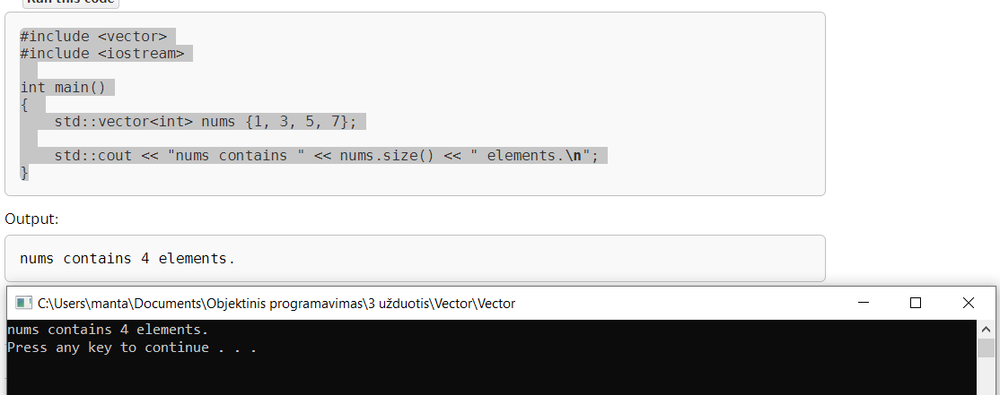

# 3-uzduotis

## Eksperimentai su sukurtąja Vector klasės realizacija:
### 1 dalis:
#### std::vector pasgrindinis pavyzdys:

#### std::vector.eempty() pavyzdys:

#### std::vector.pop_back() pavyzdys:

#### std::vector.size() pavyzdys:

#### std::vector.swap() pavyzdys:

